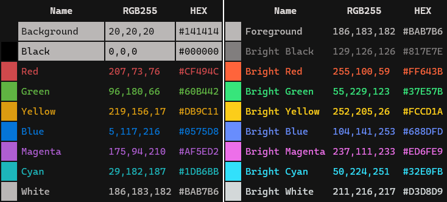
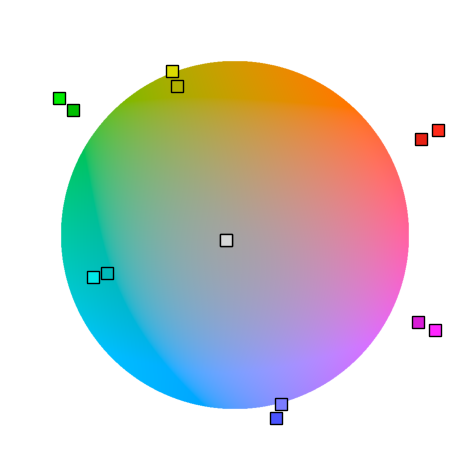
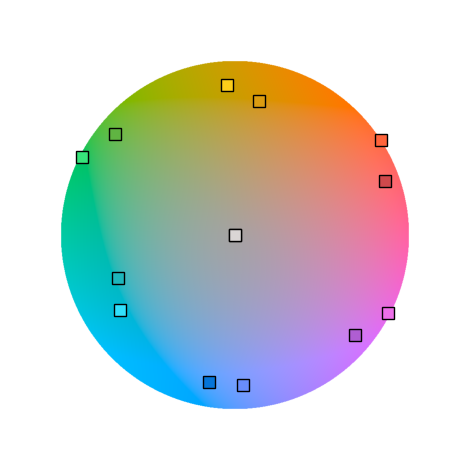

# Dimidium

A terminal color scheme, cooked with science.

  
(Font: [Cascaida Code](https://github.com/microsoft/cascadia-code))

[More preview](https://htmlpreview.github.io/?https://github.com/dofuuz/dimidium/blob/main/preview/tty-preview-nobold.html)

## Terminal config download 🛠️⬇️

See inside [config](config) directory.

## Color table

## Crafting Dimidium

Dimidium was created by adjusting traditional terminal color scheme with the CAM(Color Appearance Model). Through this, it solves the issues of default color schemes while preserving their essence.

### Color Appearance Model

Crafted with [CAM16](https://en.wikipedia.org/wiki/Color_appearance_model#CAM16), it considers the perceptual aspect(lightness, hue) of human color vision.

### Half lightness disparity

  

It reduces brightness differences to ensure all colors are well visible. Fixed common problems with typical color schemes, such as blues being too dark and greens being too vibrant.

### Uniform hue difference

 

Hue differences were equalized to maximize color variation.

Introducing hue offsets between normal/bright colors ensures even better distinction.

## Further readings

[Color appearance model - Wikipedia](https://en.wikipedia.org/wiki/Color_appearance_model)

[Cooking Terminal color scheme with 'science'](https://c.innori.com/155) (Korean)
