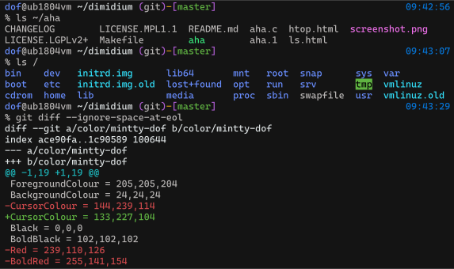
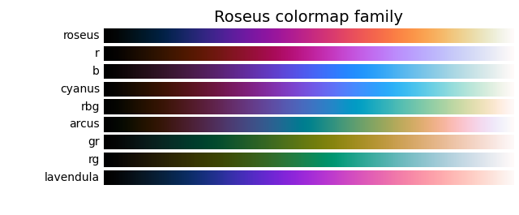

# Dimidium

Dimidium is a standard-looking terminal color scheme, adjusted to have uniform visibility across all colors.

It aims to be a solid default for terminals.

📣 **News:** Dimidium is now built into [Windows Terminal](https://aka.ms/terminal) (since [v1.23.12681.0](https://github.com/microsoft/terminal/discussions/19384)). 🥳

  
(Font: [Cascadia Code](https://github.com/microsoft/cascadia-code))

🔍 [More previews](https://htmlpreview.github.io/?https://github.com/dofuuz/dimidium/blob/main/preview/tty-preview-nobold.html)

## 🛠️ Usage

Terminal config download and guides

→ Go to the [config](config) directory.

## Color table

  
[Text version](config/README.md#color-table)

## Crafting Dimidium

By adjusting traditional color scheme, Dimidium solves visibility issues while preserving their essence.

### Color Appearance Model

Crafted with [CAM16](https://en.wikipedia.org/wiki/Color_appearance_model#CAM16), it considers the perceptual aspects(lightness, hue) of human color vision.

### Half lightness disparity

  
  
(Top: Before adjustment / Bottom: Dimidium)

By reducing perceptual lightness differences by half, common issues such as too dark blues and excessively vibrant greens have been resolved.

(Note: 'Dimidium' is Latin for 'half'.)

### Uniform hue difference

  
(Left: Before adjustment / Right: Dimidium)

Hue differences were equalized to maximize color variation.

Introducing hue offsets between normal/bright colors ensures even better distinction.

## Further reading

Explore the science behind Dimidium.

[Color appearance model - Wikipedia](https://en.wikipedia.org/wiki/Color_appearance_model)

[Dimidium: Terminal color scheme crafted with science](https://dofuuz.github.io/color/2024/03/17/dimidium-terminal-color-scheme.html) ([한국어](https://c.innori.com/155))

## Related project

### [Roseus colormap family](https://github.com/dofuuz/roseus)

Colormaps for data visualization with full range of lightness.  
They provide excellent contrast, making data clearer and easier to interpret.

