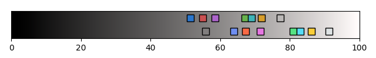

# Dimidium

Dimidium is a standard-looking color scheme, adjusted to have uniform visibility for all colors.

It aims to be a decent default for terminals.

  
(Font: [Cascaida Code](https://github.com/microsoft/cascadia-code))

🔍 [More preview](https://htmlpreview.github.io/?https://github.com/dofuuz/dimidium/blob/main/preview/tty-preview-nobold.html)

## 🛠️ Usage

Terminal config download and guides

→ See inside [config](config) directory. 

## Color table

## Crafting Dimidium

Dimidium was created by adjusting traditional color scheme. It solves the issues of default color schemes while preserving their essence.

### Color Appearance Model

Crafted with [CAM16](https://en.wikipedia.org/wiki/Color_appearance_model#CAM16), it considers the perceptual aspect(lightness, hue) of human color vision.

### Half lightness disparity

  
  
(Top: Before adjust / Bottom: Dimidium)

Reduced brightness difference ensures that all colors are easily visible. Fixed common problems of typical color schemes, such as blues being too dark and greens being too vibrant.

### Uniform hue difference

  
(Left: Before adjust / Right: Dimidium)

Hue differences were equalized to maximize color variation.

Introducing hue offsets between normal/bright colors ensures even better distinction.

## Further readings

[Color appearance model - Wikipedia](https://en.wikipedia.org/wiki/Color_appearance_model)

[Cooking Terminal color scheme with 'science'](https://c.innori.com/155) (Korean)
